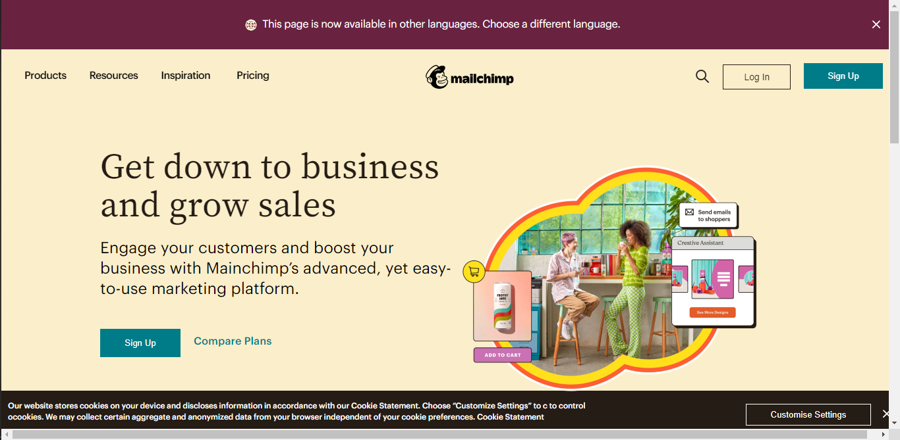
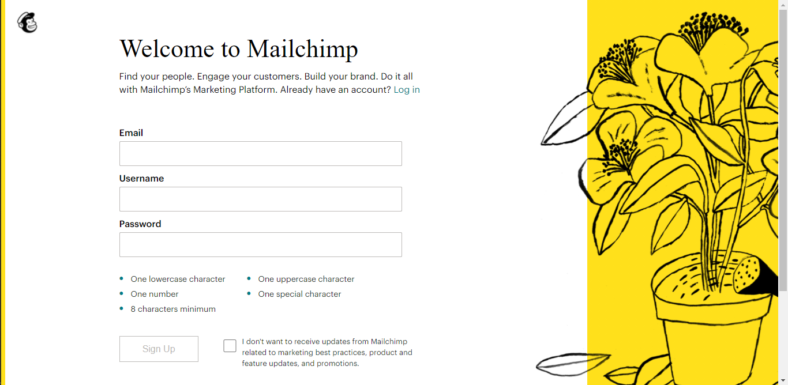
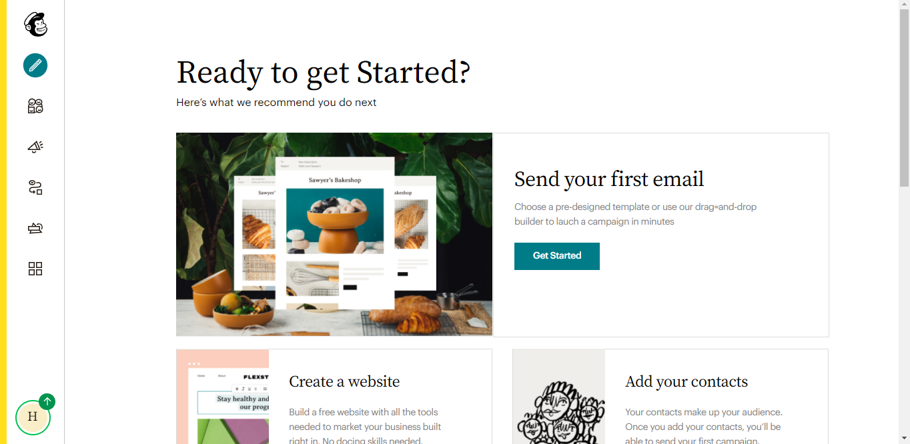
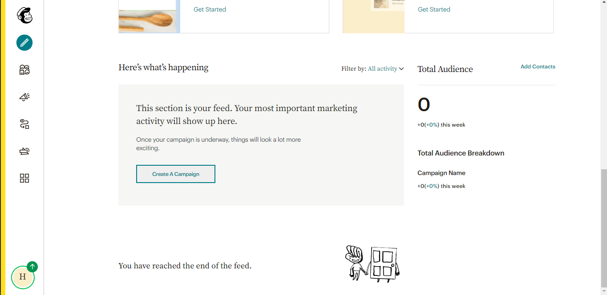
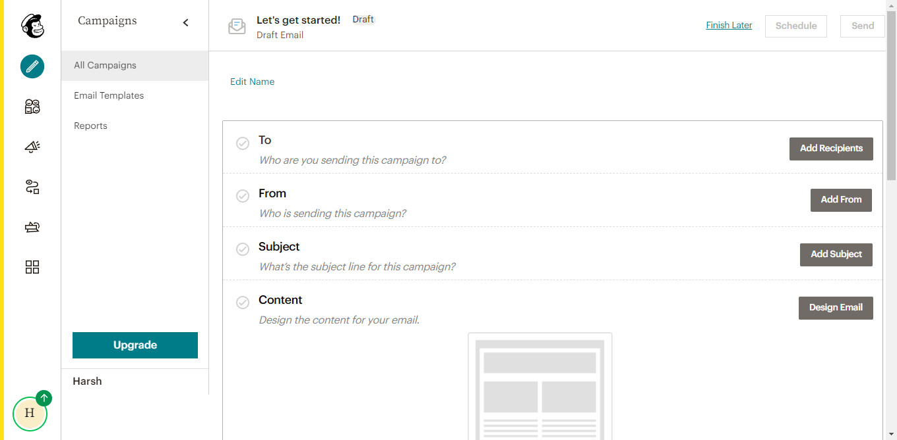

# MailChimp

lookalike of website [MailChimp](https://mailchimp.com/)

### welcome to this repo,

We a team of 4 members ([Harsh Chaturvedi](https://github.com/harshchaturvedi1), [Bicky Dutta](https://github.com/imbickydutta), [Shahnawaz Malek](https://github.com/Malek1117),[Kumar Ankush](https://github.com/imankush7)) has completed the task in 5 days and Given our best efforts to Construct this project.
 
In case of any suggestion and query feel free to connect us  
 
Take a look - [Demo](https://mail-chimp-clone.vercel.app/)

### TOOLS AND TECHNOLOGY USED >

- HTML (through React)
- css
- javascript
- React
- font Awesom icons
- bootstrap (for styling flash mesage)
- Nodejs
- ExpressJs
- mongodb atlas (for database)

### Node packages and libraries

- @fortawesome/fontawesome-svg-core: 1.2.36
- @fortawesome/free-solid-svg-icons: 5.15.4
- @fortawesome/react-fontawesome: 0.1.15
- axios : 0.21.4
- concurrently : 6.3.0
- cors : 2.8.5
- dotenv : 10.0.0
- express : 4.17.1
- mongoose : 6.0.8
- nodemon : 2.0.13
- react : 17.0.2
- react-dom : 17.0.2
- react-dropzone : 11.4.2
- react-router-dom : 5.3.0
- react-scripts : 4.0.0
- styled-components : 5.3.1

#### WEBSITE CONTENT >

> here the home, login/signup, dashboard, create an Email, begin campaigns, choose templeate,customize  
>  compaign, campaign preveiw page and track campaign status , sections are the part we have majorly focused to develop

### Home Page

### login Page

### dashboard Page part-1

### dashboard Page part-2

### Create email Page

_To further explore follow_ - [Demo](https://mail-chimp-clone.vercel.app/)

### WEBSITE USER FLOW >

the user flow that we tried to maintain is,

> home -> login/signup -> dashboard -> get started to campaign -> create campaign-> Enter email details -> choose templeate -> choose blocks/styles/comments tab -> choose images by dragging -> products name -> send campaign -> track status (through dashboard - part2 in image preveiw aboove ^)

### TEAM MEMBERS AND MESSAGE>

_we really enjoyed this whole part of developing and haad a learing experience and have given our best efforts to bring the BEST thing as POSSIBLE._

[Harsh Chaturvedi](https://github.com/harshchaturvedi1)  
[Bicky Dutta](https://github.com/imbickydutta)  
[Shahnawaz Malek](https://github.com/Malek1117)  
[Kumar Ankush](https://github.com/imankush7)
